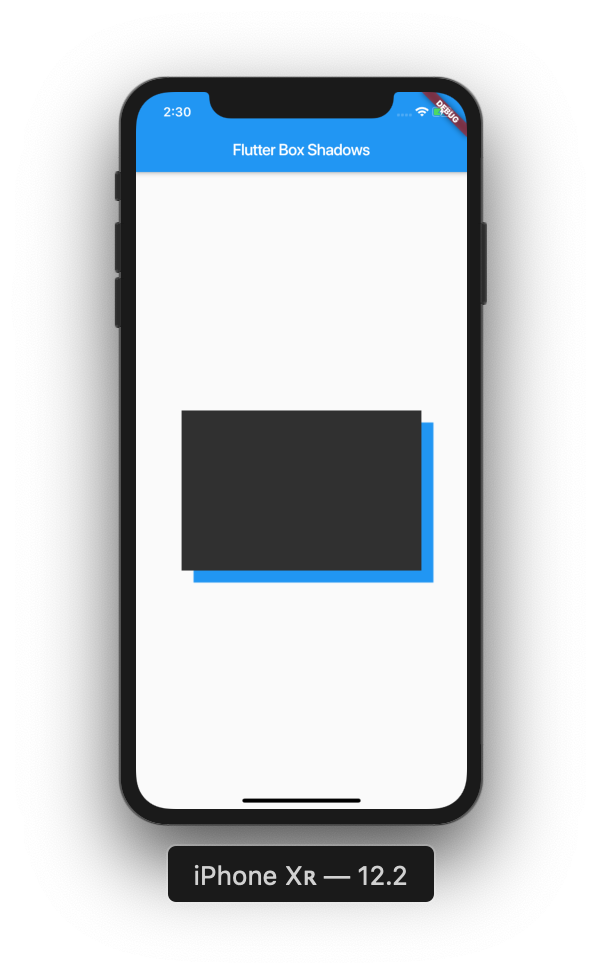

In this post we'll be covering how to use box shadows within Flutter. Box shadows are widely used nowadays, and they couldn't be simpler to implement.

> If you aren't familiar with Flutter, then you can check out my Introduction to Flutter post [here](https://owenhalliday.co.uk/introduction-to-flutter/).

## Project Setup

Okay, let's get into it! Start off by creating a new Flutter project:

```bash
# Create a new Flutter project
$ flutter create box_shadows && cd box_shadows

# Open project in VS Code
$ code .

```

Now, let's use this code to start off our application:

```dart
import 'package:flutter/material.dart';

void main() => runApp(MyApp());

class MyApp extends StatelessWidget {
  @override
  Widget build(BuildContext context) {
    return MaterialApp(
      title: 'Box Shadows',
      home: Scaffold(
        appBar: AppBar(
          title: Text('Flutter Box Shadows'),
        ),
        body: Center(
          child: Container(
            width: 300,
            height: 200,
            color: Colors.white,
            child: Container(
            ),
          ),
        ),
      ),
    );
  }
}
```

As you can see, we've got a `Center` widget, with two `Container` widgets. We've also got an `AppBar` with a `title`.

## Assigning a BoxDecoration

To use box shadows within Flutter, we need to access the `decoration` property inside of our `Container` widget, and then assign a `BoxDecoration`. Lets do that:

```dart
body: Center(
  child: Container(
    width: 300,
    height: 200,
    color: Colors.white,
    child: Container(
      decoration: BoxDecoration(
        color: Colors.grey[850],
      ),
    ),
  ),
),
```

Now we've added our `BoxDecoration` with a `color` of grey, let's start to implement our box shadow:

```dart
body: Center(
  child: Container(
    width: 300,
    height: 200,
    color: Colors.white,
    child: Container(
      decoration: BoxDecoration(
        color: Colors.grey[850],
      boxShadow: [
        BoxShadow(
          color: Colors.blue,
          offset: Offset(15, 15),
          )
        ]
      ),
    ),
  ),
),
```

Inside of our `BoxDecoration`, we've added a `boxShadow` property, which gives us the ability to use the `BoxShadow` class. Inside of our `BoxShadow` class we've added the property of `colors`, which we've made blue. Let's have a look at what that gives us:



Great! We've now integrated a simple box shadow into our application. Let's begin to explore some more properties that we can assign to our `BoxShadow` in order to change its appearance.
