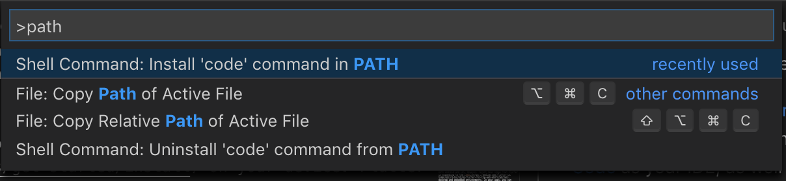
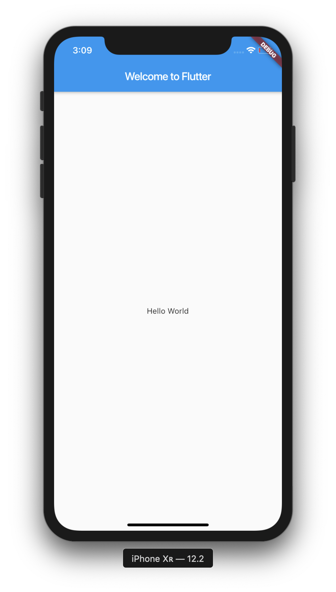
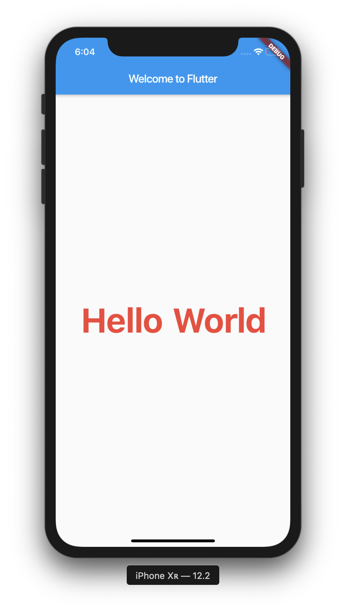

Let me guess, you love developing mobile applications, but hate the fact that you need to have multiple code bases for a single application. Also, when you make a change for one platform, it doesn't synchronise with the other and you end up running into errors.

You've tried using cross-platform frameworks such as React Native, Ionic and NativeScript, but you always have to compromise. That's where Flutter comes in.
# What is Flutter?
---
Flutter is a new and evolving cross-platform mobile development framework made by Google. It allows you to create beautiful, cross-platform mobile applications with native performance, all from one codebase.

Its support for **hot reloading** allows a developer to quickly experiment and add features with split-second reloading times. This can speed up the development progress of applications substantially, setting Flutter apart from similar frameworks.

You can learn more about hot reloading [here](https://flutter.dev/docs/development/tools/hot-reload).

Flutter takes advantage of many different techniques in order to achieve high performance and productivity. These include:

- Compiling to native code
- Using widgets and only rendering them when necessary

## What kind of things can I build with Flutter?

---

Flutter is optimised to create 2D mobile apps that run on both Android and iOS. However, recent news shows that Flutter is expanding to the [web](https://medium.com/flutter-io/hummingbird-building-flutter-for-the-web-e687c2a023a8), desktop and embedded environments. In your apps, you can implement geolocation, camera, network, 3rd-party SDKs and more. 

## What IDE can I use with Flutter?
---
Flutter supports plugins for IntelliJ, VS Code and Android Studio. It's really down to preference, but I love using VS Code, just because it's lightweight and gives me the ability to edit, build and debug with ease. 
## What language is used to write Flutter Code?
---
Dart is the programming language that is used when coding Flutter applications. Dart was first shown back in October 2011, over 7 years ago. Dart follows object-oriented programming concepts like loops, classes, functions, methods, operators and some exceptions like throw and catch. 

I would highly recommend looking at the [Dart documentation](https://dart.dev/guides) if you aren't familiar with object-oriented programming concepts.

# Installing Flutter
---
Okay, so now that we understand more about Flutter and we're comfortable with using Dart, let's get to creating our first project!

You will need to start by [installing Flutter](https://flutter.dev/docs/get-started/install) on your device. Flutter has full support for macOS, Linux and Windows. I would highly recommend using [Visual Studio Code](https://code.visualstudio.com/) as your IDE, as well as the [Dart Code extension](https://marketplace.visualstudio.com/items?itemName=Dart-Code.flutter), however Android Studio and IntelliJ are great alternatives.

You will also need to make sure you have set up your emulator, whether it's for **Android**, **iOS**, or both.

# Creating a new Flutter Project
---

Once you have installed Flutter and your IDE is set up with plugins, we can now create a new Flutter project. We can do this in many ways, but I'm going to use the terminal:

``` bash
# Creating a new flutter application 
$ flutter create demo
# Changing directory 
$ cd demo
# Opening file in VS Code
$ code .
```

---
If you're having problems such as: 

> code . is not recognised as an external or internal command, operable program or batch file

then you will need to add VS Code to your PATH. The method can be quite different depending on your operating system. I'll be going through how to do it on macOS, but if you'd like to find out how to do it on Windows, you can check it out [here](https://stackoverflow.com/questions/46638944/code-is-not-recognized-as-an-internal-or-external-command).

First of all, you need to navigate to VS Code. After that, you will need to press **Command (⌘) + Shift (⇧) + P**. This will open a command line for VS Code. Inside of this command line, you will need to type PATH, and you should see the following:



Once you see the above command, press **ENTER**. This should add the `code` command to your PATH and will allow you to open files with `code .`

Okay! That might have been a bit strenuous, but we won't have to do it ever again.

---
 Now we've opened Visual Studio Code and added the code command in our **PATH**, we need to navigate to `lib/main.dart.`

Looking at all this code that you may not recognise can be a little daunting at first. To give ourselves more of an understanding of how Dart and Flutter work, let's delete everything and start a fresh. 

```dart
import 'package:flutter/material.dart';

void main() => runApp(MyApp());
```
Firstly, we're importing the Material library. This is what allows us to create a Material application. [Material](https://material.io/) is a set of visual design standards made by Google for both mobile and web environments.

After that, the `main()` method uses arrow notation (`=>`). Arrow notation is used for one-line functions or methods. This will allow us to create a widget called `MyApp`, or whatever name you may like. Now, let's move onto the class:

```dart
class MyApp extends StatelessWidget {
  @override
  Widget build(BuildContext context) {
    return MaterialApp(
      title: 'Welcome to Flutter',
      home: Scaffold(
        appBar: AppBar(
          title: Text('Welcome to Flutter'),
        ),
        body: Center(
          child: Text('Hello World'),
        ),
      ),
    );
  }
}
```
We can see that the app extends `StatelessWidget` which in turn makes the app itself a widget. In Flutter, we'll be using widgets all the time, even for alignment, padding and more.

Very similar to React any other render-based library, the `build` method in Flutter allows us to render the elements of our UI as a widget tree, which will then display an app bar, and "Hello World!" on our screen.

You will see that we are giving the `MaterialApp` a title of "Welcome to Flutter". We also have a `Scaffold` widget from the Material Library, which provides us with a default app bar, title and body property. The body property holds the widget tree for the home screen. 

In this example, our body consists of a `Center` widget, which contains a `Text` widget. The purpose of the `Center` is to align its widget subtree to the center of the screen. 

# Running our App

Okay! Now we've created our first project with Flutter, let's see what it looks like! Open your emulator, either Android or iOS (Android Studio or Xcode).

To open the iOS emulator, run the following in your terminal:

``` bash
$ open -a Simulator
```
After that, we need to go back into VS Code and select Debug > Start Debugging, or press F5.



We can now see that our app is fully functional and working! We're off to a great start with our first ever application, but the text widget seems a little too small. Let's add some styling to make that easier to read:

``` dart
body: Center(
    child: Text('Hello World', 
    style: TextStyle(
      fontSize: 60.0,
      fontWeight: FontWeight.bold,
      color: Colors.red
      ))
   ),

```

As you can see we've supplied our `Text` widget with a `TextStyle`, which allows us to assign a number of properties, including `fontSize`, `fontWeight` and `color`. Let's see what that gives us:



Our application is starting to really come together now!

---

Great! We've now set up our system for Flutter development and created our very first application! We've integrated a `Text` widget and even added some styling.

Be sure to subscribe, because there will be more Flutter content in the future! <3

The source code for the project can be found here:

[https://github.com/ohalliday/intro-to-flutter](https://github.com/ohalliday/intro-to-flutter)


