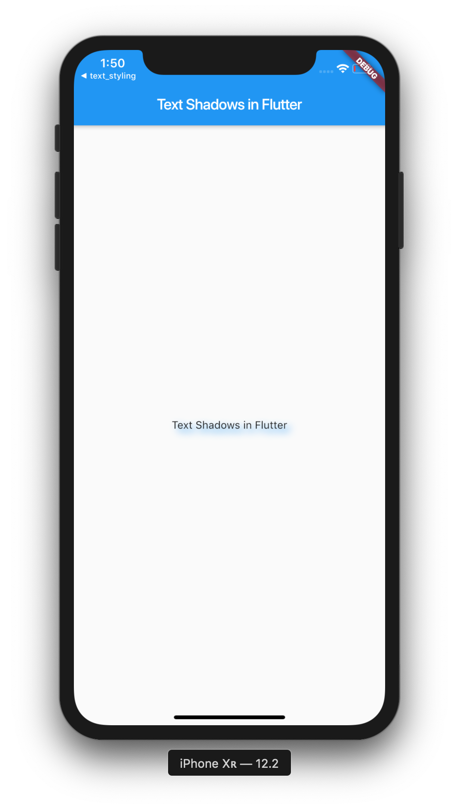
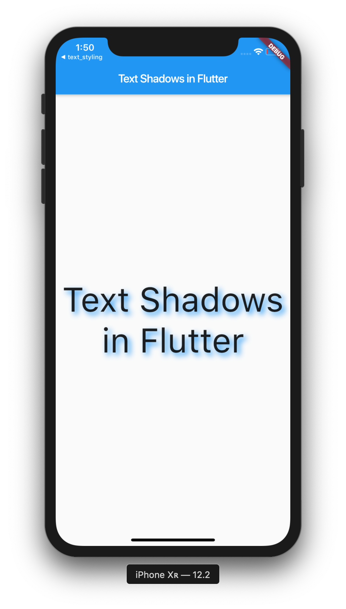
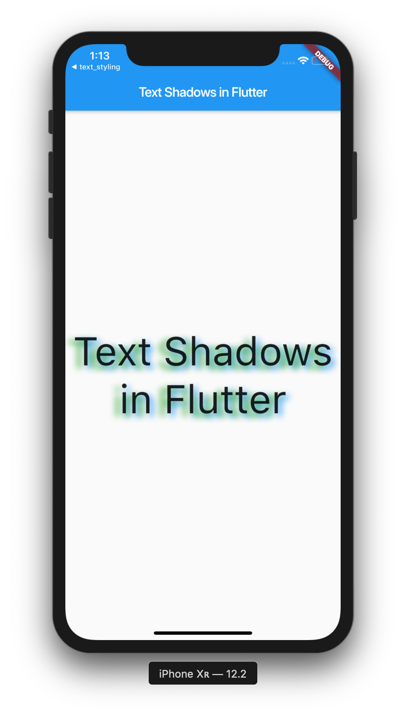

In this post we're going to explore how to use text shadows in Flutter. Text is a massive part of any application, and using shadows can make it look very stylish.

>If you aren't familiar with Flutter, then you can check out my Introduction to Flutter post [here](https://owenhalliday.co.uk/introduction-to-flutter/).

# Project Setup

Okay, let's get started! Create a new Flutter project:

```bash
# Create a new Flutter project
$ flutter create text_shadows && cd text_shadows

# Open project in VS Code
$ code .

```

Now, let's create a new `MaterialApp` inside of `main.dart` so we can begin.

```dart
import 'package:flutter/material.dart';

void main() => runApp(MyApp());

class MyApp extends StatelessWidget {
  @override
  Widget build(BuildContext context) {
    return MaterialApp(
      title: 'Text Shadows',
      home: Scaffold(
        appBar: AppBar(
          title: Text('Text Shadows in Flutter'),
        ),
        body: Center(
          child: Text('Text Shadows in Flutter'),
        ),
      ),
    );
  }
}
```

We've created a `Text` widget inside of the `body`, which is where we'll be working within this project. Now, let's supply a `TextStyle` to our `Text` widget. This will allow us to assign our `Text` widget with a text shadow.

## Creating a TextStyle

```dart
body: Center(
    child: Text('Text Shadows in Flutter',
    textAlign: TextAlign.center,
    style: TextStyle(
        ),
    ),
),
```

As you can see, we've added the `textAlign` property to our `Text` widget with a value of `TextAlign.center`. This will align our text in the center of the screen. We've also supplied our `TextStyle`, but it's currently empty. Let's fix that by adding in our shadow.

## Creating a Text Shadow

```dart
body: Center(
    child: Text('Text Shadows in Flutter',
    textAlign: TextAlign.center,
    style: TextStyle(
        shadows: [
            Shadow(
                blurRadius: 10.0,
                color: Colors.blue,
                offset: Offset(5.0, 5.0),
                ),
            ],
        ),
    ),
),
```

Okay! We can see that we've added our shadow as a property of `TextStyle`, and we've assigned the shadow properties such as `blurRadius`, `color` and `offset`. The `blurRadius` property will define the length of the shadow and how far it will be blurred, a larger number being a larger radius. The `color` property will define the color of the shadow, and the `offset` property will define the displacement of the shadow from the casting element (the text). The `offset` property will take in both x and y coordinates; positive coordinates will move the shadow to the right and down, while negative coordinates will move the shadow to the left and up.

That might be a lot to take in, but we'll get the hand of it after a few examples. Let's run our code and see what we get:



Hmm. We can see our shadow is working, but the text is way too small. Let's add the `fontSize` property inside of our `TextStyle` in order to make it bigger:

```dart
style: TextStyle(
    fontSize: 60,
    shadows: [
        Shadow(
            blurRadius: 10.0,
            color: Colors.blue,
            offset: Offset(5.0, 5.0),
            ),
        ],
    ),
```

Now let's check again and see if our text is updated:



Great! We can see that our text shadow is fully working! 

## Multiple Shadows on a Single Widget

In Flutter, we can actually add multiple shadows to a single `Text` widget, and with different colors too! Let's try that out:

```dart
style: TextStyle(
    fontSize: 60,
    shadows: [
        Shadow(
            blurRadius: 10.0,
            color: Colors.blue,
            offset: Offset(5.0, 5.0),
            ),
        Shadow(
            color: Colors.green,
            blurRadius: 10.0,
            offset: Offset(-10.0, 5.0),
            ),
        ],
    ),
```

Now we've added another shadow, with the `color` of green, let's have a look what that gives us:



We now have multiple shadows on the same `Text` widget, replicating multiple light sources. Cool huh? We can experiment with all of the different properties to customise our shadows, but we'll just leave it at that for now.

---
In this post we've learned how to apply a shadow to a `Text` widget, we've explored how to assign different properties in order to customise the shadow, and we've looked at how we can add multiple text shadows onto a single `Text` widget.

I hope you've taken a lot from this post, and don't forget to subscribe for future Flutter content! <3

>The source code for this project can be found here:
>https://github.com/ohalliday/flutter-shadows`